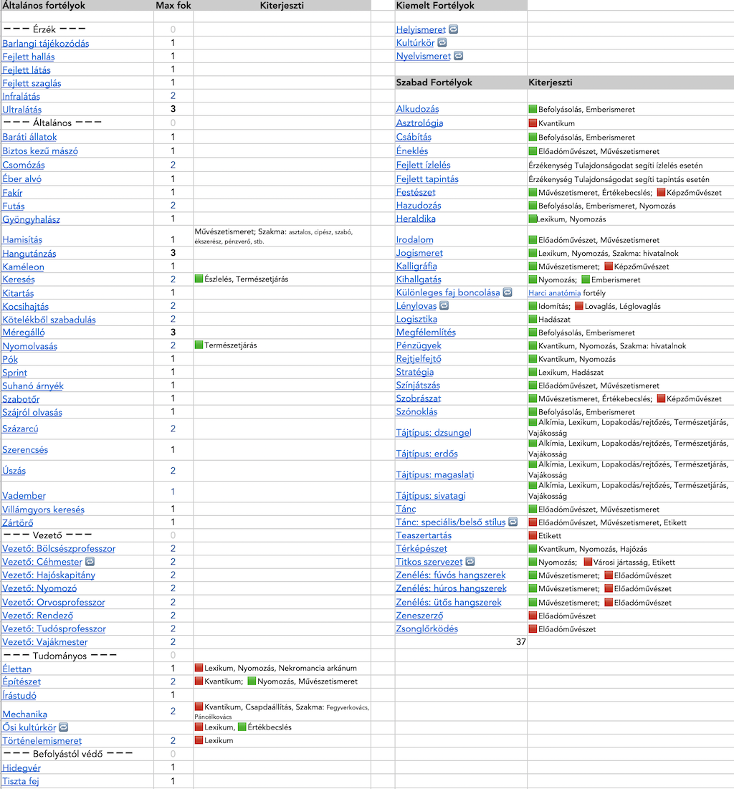

## Általános fortélyok képzettségkiterjesztés listája

🟩 Normál kiterjesztés\
🟥 Erős kiterjesztés

---

🔗 [Harci fortélyok kiterjesztéslistája](030_08_03_harci_fortelyok_kepzettsegkiterjesztes_listaja.md) →

⚜️ [Nyitóoldal](szabalyrendszer.md#3-képzettségrendszer-)
