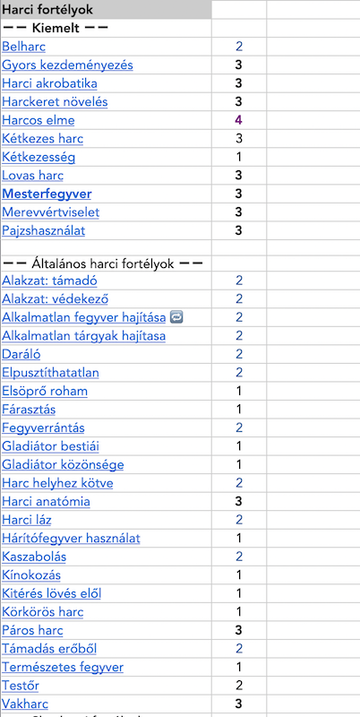
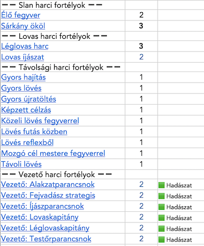

## Harci fortélyok képzettségkiterjesztés listája

🟩 Normál kiterjesztés\
🟥 Erős kiterjesztés

---

🔗 [Bázis képzettségek](030_09_bazis_kepzettsegek.md) →

⚜️ [Nyitóoldal](szabalyrendszer.md#3-képzettségrendszer-)
