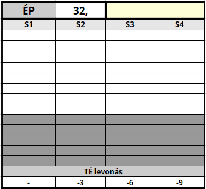

## Életerő Pont (`ÉP`)

```
ÉP = 12 + (Edzettség x 2)
```

A [Karakteralkotás fejezetben](010_10_01_ep_fp.md) már röviden említett úgynevezett **Életerő pontokat** használjuk annak modellezésére, hogy a karakter összeségében mennyi harcban elszenvedett sérülést, milyen súlyos betegségeket képes elviselni. Mikor sebet kap, ezekből a pontokból kell minden alkalommal levonnia (bővebben lásd: [Sebesülés fejezet](061_03_sebesules.md)).

### Életerő Pontok elosztása



Az **Életerő Pontok** `4` egészség kategória közt egyenlő arányban oszlanak el. A maradékot balról jobbra osztjuk el az oszlopok között. Az egyes oszlopokhoz rendelt ún. **Sebesülés kategóriák** (`S`) szimulálják, hogy milyen állapotban van a karakter: az `S1` az enyhén, `S2` a közepesen, `S3` a súlyosan, az `S4` pedig a halálosan sérült állapotot jelöli.


```
A fenti ábra 18 ÉP
  elosztását mutatja be
```

Az állapot romlásának hatásait a már említett a [Sebesülés](061_03_sebesules.md) fejezetben ismertetjük.

---

🔗 [Fáradság Pont](061_02_faradsag_pont.md) →

⚜️ [Nyitóoldal](start.md#6-harcrendszer-%EF%B8%8F)
