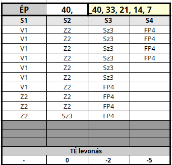

## Sebesülés

Ha a karakter találatot kap, harcértékeit - fizikumától függően - levonások sújtják. Persze a seb, ami egy nyeszlett alakot az összeesés szélére sodor, még bőven belefér egy edzett korgnak. A fentiek modellezésére kerültek bevezetésre a **Sebesülés kategóriák**.

---
### Sebesülés jelölése a táblázatban

Mikor a karaktert sebesülés éri, elkezdi bejelölni a korábban már bemutatott [Életerő táblázatban](061_01_eletero_pont.md#%C3%A9leter%C5%91-pontok-eloszt%C3%A1sa) a legmagasabb (`S1`) kategóriában lévő mezőket fentről lefelé. Mikor az első oszlop „betelt”, folytatja az `S2`, majd az `S3` kategóriában levőkkel és így tovább.

### Sebek jellegének jelölései

Hasznos segítség lehet, ha sérüléskor nem simán beikszeljük az egyes négyzeteket, hanem a sebesülés jellegét (`S,V,Z == Szúró,Vágó,Zúzó`) és „sorszámát” (hányadik seb a harc során)  írjuk beléjük.

Ezzel megkönnyítjük a dolgunkat, hiszen rögtön látjuk, hány és mekkora sebünk van.

```
S: Szúrt seb
V: Vágott seb
Z: Zúzott seb
F: FP
```

⚡ Példa: `Z2` jelölés `4 db` rubrikával
- ez a karakter második sebe
- egy `4 ÉP`nagyságú, Zúzott sebet jelöl


---
### FP jelölése az `ÉP` táblázatban

A sima `ÉP` és az [FP](061_02_faradsag_pont.md) értékek kezelése ugyanabban az `ÉP` táblázatban történik, hatásaik is megegyeznek, csak az `FP` esetén nincs valós fizikai sérülés, viszont a „sebesülés” okozta harcérték levonások úgy számítandóak, mintha valós sebzés történt volna. A gyakorlatban ez úgy néz ki, hogy ha a karakter **Fáradság Pontot** szerez, azt bejelöli a rendes `ÉP` táblázatában.

Először jelöljük be a valós sebesülés okozta `ÉP`-ket, majd utána az `FP`-ket (ajánlott egy `F` betű írása a rubrikákba).

#### ⚡ Példa FP jelölésére

```
2 db valós seb
 → 3 ÉP Vágott
 → 5 ÉP Zúzott
3 FP
```


---
### Haldoklás

```
Edzettség Tulajdonságpróba

Nehézség: 5 (Átlagos)
```

Ha a karakter `ÉP` értéke `0`-ra zuhan, akkor haldokolni kezd és a [Sérült - Haldoklás](082_statuszok.md#%EF%B8%8F-s%C3%A9r%C3%BClt-3-haldokl%C3%A1s) Státuszt kapja. Ha további sebet kap, meghal.

Ilyenkor a karakter `2` percenként `Edzettség` tulajdonságpróbát dob `Átlagos (5-ös)` Nehézség ellen, amíg nem stabilizálják. Ha a dobást elrontja, meghal.

#### Haldokló stabilizálása

```
Sebgyógyítás vagy Gyógyítás
 képzettségpróba

Nehézség: 9
```

Ha egy karaktert stabilizáltak, akkor nem kell `Edzettség` próbát dobnia, de továbbra is igaz rá, hogy minden további sebzés azonnal végez vele.

<br />

---
## Fájdalomtűrés

A [Fájdalomtűrés](kepzettsegek.primer.altalanos/fajdalomtures.md) képzettség fontos szerepet játszik a harcban elszenvedett sebek fájdalmának elnyomásában, illetve egyéb helyzetekben a kín elviselésében.

Különbséget teszünk harcon belüli és azon kívüli fájdalomtűrés között - részben játéktechnikai gyorsítás miatt, részben mert harc közben az adrenalin hatására nő a kín tűrése, valamint próbáltuk a harc heroizmusát is megőrizni.

---
### `1.` Fájdalomtűrés harc közben

Ha harc közben más sebesülés kategóriába (`S`) lép a karakter, akkor statikus `TÉ` levonást kap büntetésül. Az első (`S1`) kategóriában lévő karaktert még nem sújtják negatív módosítók, sérülése – számára – olyan könnyű, ami még nem akadályozza a harcban. Az `S2`, `S3` és `S4` kategóriákba kerülve viszont már `TÉ` büntetések sújtják.

```
TÉ levonás alap

S1:    -
S2:  -3 TÉ
S3:  -6 TÉ
S4:  -9 TÉ
```

Ennek értékét csökkentik statikusan a [Fájdalomtűrés](kepzettsegek.primer.altalanos/fajdalomtures.md) képzettség egyes szintjei, így tehát a levonások értéke karakterenként változik.

```
TÉ levonás enyhítése
  Fájdalomtűrés képzettséggel

4.szint:  1 TÉ enyhítés
6.szint:  2 TÉ enyhítés
8.szint:  3 TÉ enyhítés
10.szint: 4 TÉ enyhítés
11.szint: 5 TÉ enyhítés
12.szint: 6 TÉ enyhítés
13.szint: 7 TÉ enyhítés
14.szint: 8 TÉ enyhítés
15.szint: 9 TÉ enyhítés
```

---
### `S4` kategóriás fájdalomtűrés

```
Fájdalomtűrés (K) + Edzettség (T)
          vs
          12
```

Ha a karakter az `S4` (Súlyosan sebesült) kategóriába ér, egyszeri **([Fájdalomtűrés](kepzettsegek.primer.altalanos/fajdalomtures.md) + Edzettség)** képzettségpróbát kell dobnia **Nehéz** (`12`) célszám ellen.

Sikertelen próba esetén a karakter elájul.\
Siker esetén ezt a próbát a következő sebesüléskor kell csak újradobnia. 

🔆 A [Harci láz](fortelyok.harci/harci_laz.md) fortély egyes fokai előnyt adnak a fenti próbára.

---
### ⚡ Példa Fájdalomtűrés `TÉ` módosítóira

Tetves, a tolvaj Fájdalomtűrése `5.szintű`, ez `2` pontot enyhít.\
Ekkor az ő sebesülés táblázata így néz ki:

```
TÉ levonás összes

S1:    -
S2:  -1 TÉ
S3:  -4 TÉ
S4:  -7 TÉ
```

---
### `2.` Fájdalomtűrés harcon kívül

Mérgezés, kínzás, egyéb fájdalom esetén a karakterek **Fájdalomtűrés** képzettségpróbát kell dobnia a KM által meghatározott célszámra - általában **Önuralom** Tulajdonsággal.

<br />

---
### Sérülés hatása Tulajdonság- és Képzettségpróbára

Ha megsérül a karakter és `S3`, vagy `S4` kategóriába került, akkor ["Sérült" Státuszt](082_statuszok.md#%EF%B8%8F-s%C3%A9r%C3%BClt-1-s3) kap és az ott leírtak szerinti hatások sújtják.

<br />

---
---
### ⚡ Komplex példa sebesülésre

Lássuk Lord Gustav – Domvik lovagjának – egészség kategóriáit.

```
ÉP: 18
Fájdalomtűrés - 10.szint

S2: -0 TÉ
S3: -2 TÉ
S4: -5 TÉ
```

Minden oszlopba `4 - 4 db ÉP` kerül (`18 / 4` kerekítve).\
A maradék `2 ÉP`-t balról jobbra „osztjuk el”, tehát az `S1` és `S2` oszlopba kerülnek.



```
S1: V1 seb
```

Ha Lord Gustav egy `3 ÉP` súlyosságú **vágott** sebet kap, ami az `S1` oszlopban kerül bejelölésre fentről lefele. Ilyenkor még nem sújtja levonás.

```
S2: Z2 seb
```

Gustav ismét megsebesül. Ezúttal `5 ÉP`, zúzott seb, amivel az `S2` kategóriába kerül át.\
Mivel a **Fájdalomtűrés** képzettségének `10.szintje` már `4` ponttal mérsékli az `S2` kategóriában kapott `TÉ:-3` büntetést, ezért még itt sem sújtja harcérték levonás.

```
S3: S3 seb
```

A harmadik, **szúrt** seb ismét `3 ÉP`, ezzel Gustav a harmadik (közepesen sérült) kategóriába kerül át. Alapból (`TÉ:-6`) lenne a büntetés, de ez a fent említett **Fájdalomtűrés** képzettség bónusza miatt (`TÉ:-2`)-re mérséklődik.

```
S4: 5 FP
```

Gustav hátrálás közben belefejel a kovácsoltvas kapuba. `5 FP` a büntetése. Ezzel az `S4` (utolsó) kategóriába kerül.\
Büntetése `TÉ:-5` (az alap `-9` helyett).

Mivel `S4` kategóriába került, azonnal jön az [automatikus Fájdalomtűrás próba](#s4-kateg%C3%B3ri%C3%A1s-f%C3%A1jdalomt%C5%B1r%C3%A9s) `12` (Nehéz) ellen **Edzettség** Tulajdonsággal. Ha elrontja, akkor el is ájul.

Ha túléli a kalandot, akkor a „szerzett” `4 FP` gyógyulása `4 óra` alatt, a valós sebek okozta `ÉP` csökkenés gyógyulása pedig a [Gyógyulás](061_04_gyogyulas.md) fejezetben meghatározott ütemben történik.

---

🔗 [Gyógyulás](061_04_gyogyulas.md) →

⚜️ [Nyitóoldal](start.md#6-harcrendszer-%EF%B8%8F)
