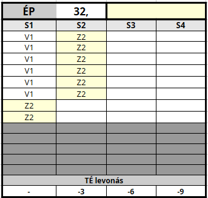
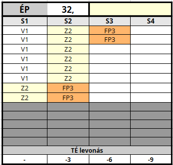

## Sebesülés

Ha a karakter találatot kap, harcértékeit - fizikumától függően - levonások sújtják. Persze a seb, ami egy nyeszlett alakot az összeesés szélére sodor, még bőven belefér egy edzett korgnak. A fentiek modellezésére kerültek bevezetésre a **Sebesülés kategóriák**.

---
### Sebesülés jelölése a táblázatban

Mikor a karaktert sebesülés éri, elkezdi bejelölni a korábban már bemutatott [Életerő táblázatban](061_01_eletero_pont.md#%C3%A9leter%C5%91-pontok-eloszt%C3%A1sa) a legmagasabb (`S1`) kategóriában lévő mezőket fentről lefelé. Mikor az első oszlop „betelt”, folytatja az `S2`, majd az `S3` kategóriában levőkkel és így tovább.

### Sebek jellegének jelölései

Hasznos segítség lehet, ha sérüléskor nem simán beikszeljük az egyes négyzeteket, hanem a sebesülés jellegét (`S,V,Z == Szúró,Vágó,Zúzó`) és „sorszámát” (hányadik seb a harc során)  írjuk beléjük.

Ezzel megkönnyítjük a dolgunkat, hiszen rögtön látjuk, hány és mekkora sebünk van.

```
S: Szúrt seb
V: Vágott seb
Z: Zúzott seb
F: FP
```

⚡ Példa: `Z2` jelölés `4 db` rubrikával
- ez a karakter második sebe
- egy `4 ÉP`nagyságú, Zúzott sebet jelöl



---
### FP jelölése az `ÉP` táblázatban

A sima `ÉP` és az [FP](061_02_faradsag_pont.md) értékek kezelése ugyanabban az `ÉP` táblázatban történik, hatásaik is megegyeznek, csak az `FP` esetén nincs valós fizikai sérülés, viszont a „sebesülés” okozta harcérték levonások úgy számítandóak, mintha valós sebzés történt volna. A gyakorlatban ez úgy néz ki, hogy ha a karakter **Fáradság Pontot** szerez, azt bejelöli a rendes `ÉP` táblázatában.

Először jelöljük be a valós sebesülés okozta `ÉP`-ket, majd utána az `FP`-ket (ajánlott egy `F` betű írása a rubrikákba).

#### ⚡ Példa FP jelölésére

```
2 db valós seb
 → 3 ÉP Vágott
 → 5 ÉP Zúzott
3 FP
```



---
### Haldoklás

```
Edzettség Tulajdonságpróba

Nehézség: 5 (Átlagos)
```

Ha a karakter `ÉP` értéke `0`-ra zuhan, akkor haldokolni kezd és a [Sérült - Haldoklás](082_statuszok.md#%EF%B8%8F-s%C3%A9r%C3%BClt-3-haldokl%C3%A1s) Státuszt kapja. Ha további sebet kap, meghal.

Ilyenkor a karakter `2` percenként `Edzettség` Tulajdonságpróbát dob `Átlagos (5)` Nehézség ellen, amíg nem stabilizálják. Ha a dobást elrontja, meghal.

#### Haldokló stabilizálása

```
Sebgyógyítás vagy Gyógyítás
 képzettségpróba

Nehézség: 9
```

Ha egy karaktert stabilizáltak, akkor nem kell `Edzettség` próbát dobnia, de továbbra is igaz rá, hogy minden további sebzés azonnal végez vele.

<br />

---
### Sérülés hatása Tulajdonság- és Képzettségpróbára

Ha megsérül a karakter és `S3`, vagy `S4` kategóriába került, akkor ["Sérült" Státuszt](082_statuszok.md#%EF%B8%8F-s%C3%A9r%C3%BClt-1-s3) kap és az ott leírtak szerinti hatások sújtják.

<br />

---

🔗 [Fájdalomtűrés sebesüléskor](061_04_fajdalomtures_sebesuleskor.md) →

⚜️ [Nyitóoldal](start.md#6-harcrendszer-%EF%B8%8F)
