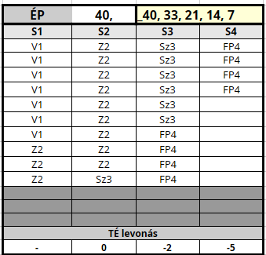

## ⚡ Komplex példa sebesülésre

Lássuk Lord Gustav – Domvik lovagjának – egészség kategóriáit.

```
ÉP: 40 (28 + 3 x 4(Edzettség))
Fájdalomtűrés - 10.szint

S2: -0 TÉ
S3: -2 TÉ
S4: -5 TÉ
```

Minden oszlopba `10 - 10 db ÉP` kerül (`40 / 4`).



```
S1: V1 seb
```

Ha Lord Gustav egy `7 ÉP` súlyosságú **vágott** sebet kap, ami az `S1` oszlopban kerül bejelölésre fentről lefele. Ilyenkor még nem sújtja levonás.

```
S2: Z2 seb
```

Gustav ismét megsebesül. Ezúttal `12 ÉP`, zúzott seb, amivel az `S2` kategóriába kerül át.\
Mivel a **Fájdalomtűrés** képzettségének `10.szintje` már `4` ponttal mérsékli az `S2` kategóriában kapott `TÉ:-3` büntetést, ezért még itt sem sújtja harcérték levonás.

```
S3: S3 seb
```

A harmadik, **szúrt** seb ismét `7 ÉP`, ezzel Gustav a harmadik (közepesen sérült) kategóriába kerül át. Alapból (`TÉ:-6`) lenne a büntetés, de ez a fent említett **Fájdalomtűrés** képzettség bónusza miatt (`TÉ:-2`)-re mérséklődik.

```
S4: 8 FP
```

Gustav hátrálás közben belefejel a kovácsoltvas kapuba. `8 FP` a büntetése. Ezzel az `S4` (utolsó) kategóriába kerül.\
Büntetése `TÉ:-5` (az alap `-9` helyett).

Mivel `S4` kategóriába került, azonnal jön az [automatikus Fájdalomtűrás próba](061_04_fajdalomtures_sebesuleskor.md#s4-kateg%C3%B3ri%C3%A1s-f%C3%A1jdalomt%C5%B1r%C3%A9s) `12` (Nehéz) ellen **Edzettség** Tulajdonsággal. Ha elrontja, akkor el is ájul.

Ha túléli a kalandot, akkor a „szerzett" `8 FP` gyógyulása `8 óra` alatt, a valós sebek okozta `ÉP` csökkenés gyógyulása pedig a [Gyógyulás](061_06_gyogyulas.md) fejezetben meghatározott ütemben történik.

---

🔗 [Gyógyulás](061_06_gyogyulas.md) →

⚜️ [Nyitóoldal](szabalyrendszer.md#6-harcrendszer-️)
